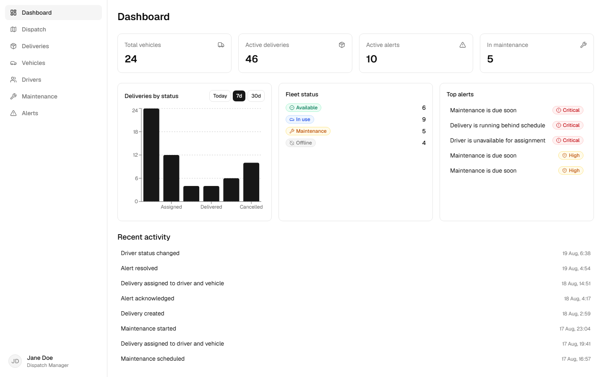
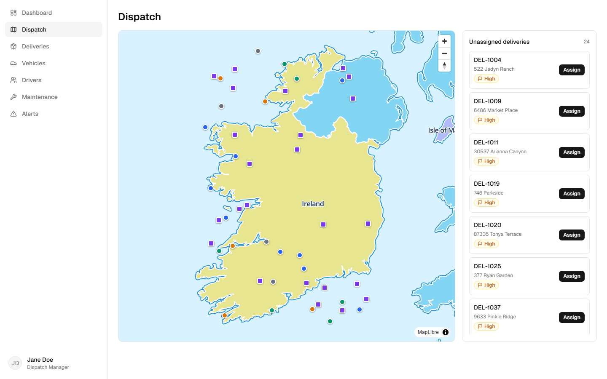
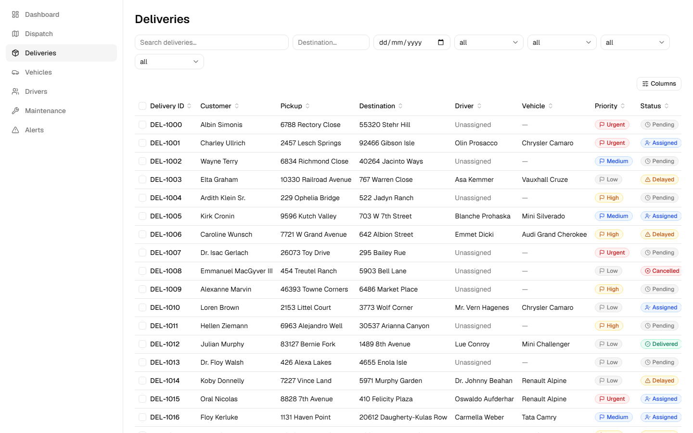

# FleetOS

**A portfolio-grade fleet & logistics operations dashboard** — a production-style React/TypeScript frontend for managing vehicles, drivers, deliveries, services, dispatch, and operational alerts, built against a fully simulated backend (real HTTP requests, network latency, and mutable state — not static JSON).

**[Live demo →](https://danilomsilva.github.io/fleet-and-logistics/)** &nbsp;·&nbsp; no login required, boots straight into the dashboard

[](https://github.com/danilomsilva/fleet-and-logistics/actions/workflows/ci.yml)
[](https://github.com/danilomsilva/fleet-and-logistics/actions/workflows/deploy.yml)


<p>
  
  
</p>

## Why this project exists

Most portfolio dashboards are a handful of static cards on top of hardcoded JSON. FleetOS is built the way a real internal tool would be: a mock API layer (MSW) that intercepts genuine `fetch` calls, applies pagination/filtering/sorting/search server-side, adds randomized network latency, and maintains mutable relational state across a session — so every loading state, empty state, error path, and optimistic update in the UI is exercising real async logic, not a shortcut. The goal was to demonstrate the parts of frontend engineering that don't show up in a five-minute demo: state management under real async conditions, accessibility, test strategy, and performance — see [the spec's portfolio objective](docs/1-product-specification.md#14-important-portfolio-objective) for the explicit brief this was built against.

> **Note on data persistence:** "Mutable relational state across a session" means exactly that — a session. There's no real backend, so all writes (assigning a delivery, editing a vehicle, etc.) live in an in-memory store inside that browser tab. Reloading the page, or opening the app in a new tab, reseeds it from scratch. Within a session, though, the data is fully relational: assigning a driver+vehicle to a delivery from Dispatch, for instance, updates the delivery *and* that driver's and vehicle's own records (status, mutual assignment) — try it, then check the Drivers/Vehicles screens without reloading.

## Engineering highlights

- **TypeScript strict mode, zero errors** across the app, the mock API layer, and the Playwright test suite (three separate `tsconfig`s, all checked in CI).
- **182 Vitest unit/component tests + 35 Playwright e2e tests**, ~73% statement coverage on application code (`npm run test:coverage`). Every major page and dialog is also scanned with `axe-core` for accessibility violations as part of the unit suite.
- **CI on every push and PR** — lint, typecheck (including e2e specs), unit tests, production build, and the full e2e suite, via [GitHub Actions](.github/workflows/ci.yml).
- **Route-level code splitting**: the initial bundle is ~326 KB gzipped; MapLibre GL (~250 KB gzipped) and Recharts load only when their own routes are visited.
- **Accessibility built in, not retrofitted**: every status is communicated by icon + text (never color alone), all interactive controls have accessible names, focus-visible rings and a skip link are present, and the data table's sort/pagination/selection controls are fully keyboard-operable.
- **A real optimistic-update pattern**: delivery/service status changes and alert acknowledge/resolve update the UI immediately via TanStack Query's `onMutate`/`onError`/`onSettled`, rolling back cleanly on failure.
- **Debugged and fixed real third-party integration bugs**, not just app code — see [Notable bugs found & fixed](#notable-bugs-found--fixed) below.

## Features

| Screen | What it does |
|---|---|
| **Dashboard** | KPI cards, a delivery-status chart with a Today/7d/30d toggle, fleet-status breakdown, top alerts, and a recent-activity feed — all aggregated from the same endpoints the other screens use, not separate mock numbers. |
| **Vehicles / Drivers** | Sortable, filterable, searchable tables with column visibility, row selection, and bulk status/delete actions; detail pages with tabbed history (service, deliveries, activity). Both support full add/edit/delete, with driver-vehicle assignment relinked server-side on every change so the fleet roster and driver records never go out of sync — including reassigning a vehicle already claimed by another driver. |
| **Deliveries** | The most complex table: a full filter set reflected in the URL (bookmarkable/shareable views), a detail page with state-dependent actions (assign → start → deliver / delay), and an assignment dialog that clearly explains *why* no driver/vehicle is available rather than showing an empty dropdown. |
| **Dispatch** | A MapLibre GL map of fleet vehicles and unassigned delivery pickups (color/shape-coded by status), an unassigned-deliveries panel, and a Zustand-backed assignment wizard (driver → vehicle → review → confirm) — conflict prevention happens at the data layer: each step only offers entities the API reports as actually available. |
| **Services** | Scheduling and status transitions (due → in progress → completed) with optimistic updates. |
| **Alerts** | Inline acknowledge/resolve actions and click-through navigation to the alert's related vehicle, driver, or delivery. |



## Tech stack

| Concern | Choice |
|---|---|
| Framework / build | React 19, TypeScript (strict), Vite |
| Routing | React Router v7, lazy-loaded routes |
| Server state | TanStack Query (caching, optimistic mutations, retries) |
| Tables | TanStack Table (headless) + a single reusable `DataTable` |
| Client/UI state | Zustand (sidebar drawer, dispatch wizard) |
| Mock API | MSW (Mock Service Worker) + `@faker-js/faker`, seeded and relationally consistent |
| Map | MapLibre GL JS |
| Charts | Recharts |
| UI components | shadcn/ui (Base UI primitives) + Tailwind CSS v4 |
| Validation | Zod |
| Unit/component testing | Vitest, React Testing Library, `vitest-axe` |
| E2E testing | Playwright |
| CI/CD | GitHub Actions → GitHub Pages |

## Testing & quality

```
npm run test           # 182 unit/component tests (Vitest + RTL), incl. axe accessibility checks
npm run test:coverage  # same, with a coverage report
npm run test:e2e       # 35 Playwright e2e tests covering every screen's critical flows
npm run lint           # ESLint + a full TypeScript check of the e2e suite
npx tsc -b             # strict-mode type check of the app + mock API layer
```

Testing strategy is deliberately layered rather than maximizing unit coverage for its own sake: shared components (`DataTable`, dialogs, status badges) and business logic (query hooks, generators, mock API handlers) get focused unit tests, while full user flows — assigning a delivery, filtering a table and reloading to confirm the URL persisted, acknowledging an alert — are verified end-to-end with Playwright against the real mock API, since that's what actually proves the flow works.

## Notable bugs found & fixed

A few real, non-obvious bugs surfaced during development and are worth calling out because they were genuinely tricky to diagnose:

1. **MapLibre's worker silently failed in production.** MapLibre GL JS's tile-parsing web worker has its own relative import to a sibling file; a plain Vite `?url` import only copies the one requested file, so the worker loaded, then silently died the instant it tried to import its own dependency — no visible error, just a map that only ever rendered its background color. Root-caused via a live Playwright session (see the regression test in `e2e/dispatch.spec.ts`) and fixed by copying both files together, unrenamed, via `vite-plugin-static-copy`.
2. **A CSS Grid `min-height: auto` trap** was letting the Dispatch page's unassigned-deliveries list stretch the entire map row to ~2400px tall instead of the intended viewport-filling layout — a one-line `min-h-0` fix, but the kind of bug that's invisible in a quick look and only shows up once real (unbounded) content is in the list.
3. **Assigning a delivery from Dispatch never updated the driver or vehicle themselves.** The assign handler set `driverId`/`vehicleId` on the *delivery* but never touched the driver's or vehicle's own record — so their detail pages still showed "unassigned"/"available" afterwards, and the same driver stayed selectable for a second delivery at the same time (a real double-booking gap). Fixed by relinking both sides of the pairing (including stealing the vehicle away from whichever driver previously held it) and marking them actively engaged (`driving`/`in_use`), which reverts back to `available` once the delivery is delivered or cancelled — the driver-vehicle pairing itself persists across that, matching how a real fleet operates.

## Getting started

```
npm install
npm run dev          # start the dev server at localhost:5173
```

## Deployment

Every push to `main` deploys to GitHub Pages via [`.github/workflows/deploy.yml`](.github/workflows/deploy.yml). The app is entirely client-side (Vite + MSW, no real backend), so a static host works as-is: the workflow builds with a `GH_PAGES_BASE` env var that `vite.config.ts` reads for the asset base path, and `main.tsx` reads for the router `basename` and the mock service worker's registration URL (both default back to `/` for local dev). `index.html` is copied to `404.html` so a direct load of any route falls back to the client-side router.

## Project docs

- [`docs/1-product-specification.md`](docs/1-product-specification.md) — the product spec this was built against.
- [`docs/2-product-implementation-plan.md`](docs/2-product-implementation-plan.md) — architecture decisions, build order, and the full milestone-by-milestone execution log.

## License

[MIT](LICENSE)
